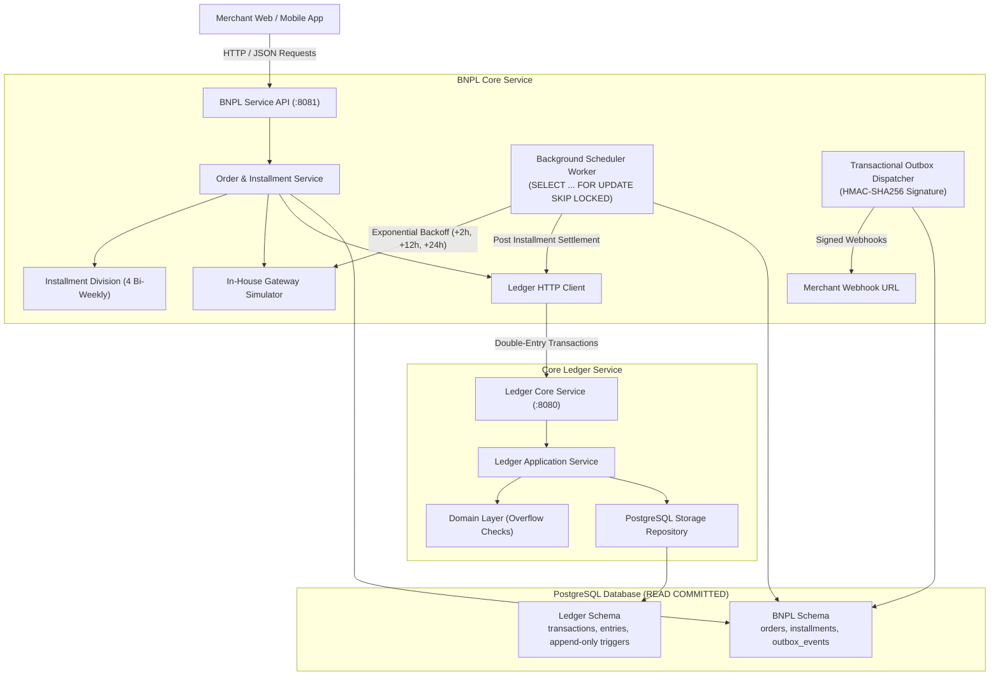

# Ledgerly

[](https://golang.org)
[](https://www.postgresql.org)
[](LICENSE)

**Ledgerly** is a high-integrity, production-grade **Buy Now, Pay Later (BNPL)** platform whose foundational core is an **immutable, append-only double-entry financial ledger** written in Go.

The platform splits purchases into installments, records every monetary movement as immutable balanced accounting entries, enforces concurrency-safe deterministic row locking, and provides atomic idempotency guarantees.

---

## 🏛️ System Architecture



---

## 💎 Financial & Engineering Principles

### 1. Money Representation & Safe Arithmetic
* All monetary amounts are represented as strict 64-bit signed integers (`int64`) in the minor unit of the currency (e.g., cents for USD: `$10.50` = `1050`).
* Floating-point numbers (`float32`, `float64`) are **strictly prohibited** across domain models, storage schemas, and API payloads.
* All monetary calculations implement **overflow-checked arithmetic** (`Add`, `Sub`, `Mul`) protecting against `math.MaxInt64` and `math.MinInt64` boundary exploits.
* BNPL installment division guarantees that the sum of 4 bi-weekly installments equals the total purchase amount down to the single cent, with non-divisible remainders assigned to the initial down payment (Cuota 1).

### 2. Double-Entry Zero-Sum Invariant
Every transaction consists of at least two `Entry` records satisfying:
$$\sum \text{Debits} - \sum \text{Credits} = 0$$
All entries within a single transaction must share the same ISO 4217 currency code.

### 3. Append-Only Immutability
* Records in `transactions` and `entries` can **never** be edited or deleted.
* PostgreSQL triggers (`BEFORE UPDATE OR DELETE`) raise SQLSTATE `55000` exceptions if modification or deletion is attempted.
* Corrections or disputes are executed exclusively through balancing **reversal transactions**.
* Single-reversal constraint: A transaction can only be reversed once (`UNIQUE(reversal_of)`).

### 4. Concurrency Control & Deadlock Elimination
* Transaction isolation level: **`READ COMMITTED` with deterministic row-level pessimistic locking (`SELECT ... FOR UPDATE`)**.
* Involved account IDs are sorted in strict lexicographical order (`account_id ASC`) prior to lock acquisition, eliminating cyclic dependencies and preventing deadlocks.
* Tested under high contention with parallel stress tests (50+ simultaneous goroutines).

### 5. Atomic Idempotency Pattern
* The idempotency key and canonical request hash (SHA-256) are persisted in the **same atomic database transaction** as the financial entries.
* Schema constraint: `UNIQUE (client_id, idempotency_key)`.
* Executed via `INSERT ... ON CONFLICT (client_id, idempotency_key) DO NOTHING`:
  - **New Request**: Row inserted, locks acquired, entries recorded, returns `201 Created`.
  - **Identical Retry**: Conflict occurs, original transaction loaded, hash matches, returns `200 OK` without duplicating entries.
  - **Payload Mismatch**: Same key with different payload/amounts returns `409 Conflict`.
  - **Concurrent Requests**: Interlocking unique index locks cause the second request to wait safely for the first to commit or rollback.

### 6. Installment Scheduler with Worker Leasing & Exponential Backoff
* Background workers lease due installments using `SELECT ... FOR UPDATE SKIP LOCKED`, preventing multiple worker instances from double-charging the same installment.
* Automated retry policy for declined attempts follows an exponential backoff schedule:
  - Attempt 1 fails &rarr; Retry in **+2 hours** (status: `retrying`)
  - Attempt 2 fails &rarr; Retry in **+12 hours** (status: `retrying`)
  - Attempt 3 fails &rarr; Retry in **+24 hours** (status: `retrying`)
  - Attempt 4 fails &rarr; Terminal default: installment marked `failed`, order transitioned to `defaulted`.

### 7. Transactional Outbox for Signed Webhooks
* All domain events (`order.created`, `order.completed`, `installment.paid`, `order.defaulted`) are written to an `outbox_events` table inside the same ACID database transaction that updates business state.
* The outbox dispatcher asynchronously sends HTTP POST requests to merchant webhook endpoints with HMAC-SHA256 signatures (`X-Ledgerly-Signature`) for tamper-proof delivery.

---

## 📑 Architecture Decision Records (ADRs)

All foundational architectural decisions are documented in [`docs/adr/`](docs/adr/):

| ADR | Title | Status |
| :--- | :--- | :--- |
| [ADR-0001](docs/adr/0001-double-entry-invariants-and-money-representation.md) | Double-Entry Invariants, Money Representation, and Immutability | Accepted |
| [ADR-0002](docs/adr/0002-concurrency-control-and-isolation-strategy.md) | Concurrency Control, Isolation Strategy, and Race Validation | Accepted |
| [ADR-0003](docs/adr/0003-idempotency-pattern-and-concurrent-requests.md) | Idempotency Pattern, Atomic SQL Transactions, and Concurrent Retries | Accepted |
| [ADR-0004](docs/adr/0004-build-vs-buy-in-house-payment-gateway-simulator.md) | In-House Deterministic Payment Gateway Simulator | Accepted |
| [ADR-0005](docs/adr/0005-installment-scheduler-worker-leasing-and-backoff.md) | Installment Scheduler, Concurrency-Safe Leasing, and Exponential Backoff | Accepted |
| [ADR-0006](docs/adr/0006-transactional-outbox-pattern-for-webhooks.md) | Transactional Outbox Pattern for Asynchronous Webhook Delivery | Accepted |
| [ADR-0007](docs/adr/0007-web-dashboard-architecture-and-state-management.md) | Web Dashboard Architecture, State Management, and Design System | Accepted |
| [ADR-0008](docs/adr/0008-mobile-application-architecture.md) | Mobile Application Architecture and Payment Flow | Accepted |
| [ADR-0009](docs/adr/0009-cloud-infrastructure-and-ci-cd-pipeline.md) | Cloud Infrastructure, Kubernetes Deployment, and Multi-Stage CI/CD | Accepted |

---

## 🚀 Getting Started

### Prerequisites
* [Docker](https://www.docker.com/) & Docker Compose
* [Go 1.24+](https://golang.org) (optional, if running locally without Docker)

### Running with Docker Compose
```bash
docker compose up -d --build
```
This spins up:
- **PostgreSQL 16** on port `5432` with health checks.
- **Ledger Core API** on port `8080` (auto-applying ledger database migrations).
- **BNPL API & Scheduler** on port `8081` (auto-applying BNPL database migrations).

Check service health:
```bash
curl http://localhost:8080/healthz
curl http://localhost:8081/healthz
```

---

## 🧪 Testing Suite

The repository incorporates three layers of testing:

### 1. Domain Unit Tests & Rapid Property-Based Testing
Tests mathematical properties (commutativity, inverse elements, zero-sum preservation under arbitrary splits):
```bash
make test-unit
make test-property
```

### 2. PostgreSQL Integration Tests
Runs against real PostgreSQL instances (via `embedded-postgres` or local Docker PostgreSQL):
```bash
make test-integration
```
Verifies:
- Immutability trigger rejections (`UPDATE` / `DELETE`).
- Deferred constraint trigger rollbacks on unbalanced entries or empty transactions.
- Idempotency retries and conflict detection.
- Concurrent request serialization on the same idempotency key.
- 50-goroutine stress test ensuring zero deadlocks and global ledger balance preservation.

### 3. Run All Tests
```bash
make test
```

---

## 📡 API Reference & Examples

### 1. Create an Account
Supported types: `customer`, `merchant`, `platform`, `fees`.
```bash
curl -X POST http://localhost:8080/v1/accounts \
  -H "Content-Type: application/json" \
  -H "X-Client-ID: my_merchant_app" \
  -d '{
    "type": "customer",
    "currency": "USD"
  }'
```

### 2. Query Account Balance
Returns real-time aggregated debits and credits:
```bash
curl http://localhost:8080/v1/accounts/{account_id}/balance
```

### 3. Record a Balanced Transaction (with Idempotency)
```bash
curl -X POST http://localhost:8080/v1/transactions \
  -H "Content-Type: application/json" \
  -H "Idempotency-Key: purchase_order_tx_001" \
  -H "X-Client-ID: my_merchant_app" \
  -d '{
    "description": "BNPL Purchase - Order #1001",
    "entries": [
      {
        "account_id": "CUSTOMER_ACCOUNT_UUID",
        "amount": 10000,
        "direction": "DEBIT",
        "currency": "USD"
      },
      {
        "account_id": "MERCHANT_ACCOUNT_UUID",
        "amount": 9500,
        "direction": "CREDIT",
        "currency": "USD"
      },
      {
        "account_id": "FEES_ACCOUNT_UUID",
        "amount": 500,
        "direction": "CREDIT",
        "currency": "USD"
      }
    ]
  }'
```

### 4. Reverse a Transaction
```bash
curl -X POST http://localhost:8080/v1/transactions/{transaction_id}/reverse \
  -H "Content-Type: application/json" \
  -H "Idempotency-Key: refund_order_001" \
  -H "X-Client-ID: my_merchant_app" \
  -d '{
    "description": "Refund for Order #1001"
  }'
```

### 5. Query Account Ledger Entries (Statement)
```bash
curl "http://localhost:8080/v1/accounts/{account_id}/entries?limit=20&offset=0"
```

---

## 🛍️ BNPL Service API Reference (Port 8081)

### 1. Create a BNPL Order (Pay-in-4)
Automatically breaks the order into 4 bi-weekly installments and charges Cuota 1 (down payment) synchronously:
```bash
curl -X POST http://localhost:8081/v1/orders \
  -H "Content-Type: application/json" \
  -H "X-Client-ID: my_ecommerce_store" \
  -d '{
    "customer_account_id": "CUSTOMER_ACCOUNT_UUID",
    "merchant_account_id": "MERCHANT_ACCOUNT_UUID",
    "total_amount": 10000,
    "currency": "USD",
    "payment_method_token": "pm_card_visa",
    "merchant_webhook_url": "https://store.example.com/webhooks/ledgerly"
  }'
```

### 2. Query Order & Installments Schedule
```bash
curl http://localhost:8081/v1/orders/{order_id}
```

### 3. Pay an Installment Manually
```bash
curl -X POST http://localhost:8081/v1/installments/{installment_id}/pay \
  -H "Content-Type: application/json" \
  -d '{
    "payment_method_token": "pm_card_mastercard"
  }'
```

### 4. Deterministic Payment Gateway Simulator Tokens
The built-in simulator recognizes synthetic test cards without requiring external sandbox credentials:
| Token | Behavior | Simulated Latency |
| :--- | :--- | :--- |
| `pm_card_visa` | **Success** (returns transaction reference) | 100ms |
| `pm_card_mastercard` | **Success** | 100ms |
| `pm_card_declined` | **Declined**: General card decline | 100ms |
| `pm_card_insufficient_funds` | **Declined**: Insufficient customer credit | 100ms |
| `pm_card_expired` | **Declined**: Card expired | 100ms |
| `pm_card_timeout` | **Transient Timeout**: Simulates gateway network drop | 300ms |
| `pm_card_rate_limited` | **Rate Limited**: HTTP 429 backoff simulator | 50ms |

### 5. Webhook Signature Verification
All webhooks delivered to `merchant_webhook_url` include the signature header:
```
X-Ledgerly-Signature: sha256=<HMAC-SHA256 hex digest>
X-Ledgerly-Event-Type: order.created | installment.paid | order.completed | order.defaulted
X-Ledgerly-Timestamp: 2026-09-29T03:00:00Z
```
Merchants verify using `HMAC_SHA256(payload_body, webhook_secret)`.

---

## 💻 Web Dashboard (Port 3000)

Ledgerly provides an interactive, dark-mode fintech operator and merchant web application built with **React 19**, **TypeScript**, and **Vite** (located in [`web/`](web/)):

1. **Pay-in-4 Checkout Simulator**:
   - Live cent calculations with remainder allocation to Cuota 1.
   - Test card selection (`pm_card_visa`, `pm_card_insufficient_funds`, `pm_card_timeout`, etc.).
   - Instant order creation with synchronous Cuota 1 payment.
2. **Merchant & Operator Console**:
   - Real-time orders pipeline with installment timeline visualizer.
   - Installment settlement status: `paid`, `pending`, `retrying`, or `failed`.
   - Manual early repayment modal with test payment method selection.
3. **Double-Entry Ledger Visualizer**:
   - Accounts monitor with live balances (`customer`, `merchant`, `platform`, `fees`).
   - $\sum \text{Debits} = \sum \text{Credits}$ real-time invariant badge.
   - One-click immutable transaction reversal (refund).
4. **Transactional Outbox Inspector**:
   - Live feed of webhook events (`order.created`, `installment.paid`, etc.).
   - HMAC-SHA256 signature inspector for webhook verification debugging.
5. **Fintech Architecture Modal**:
   - Interactive breakdown of the 6 fundamental invariants for technical interview demonstrations.

To run the web application locally:
```bash
cd web
npm install
npm run dev
# Accessible at http://localhost:3000
```

---

## 📱 Mobile Customer Application (Expo / React Native)

The customer-facing mobile application is located in [`mobile/`](mobile/) and built with **React Native** and **Expo**:

- **Home Screen**: Active credit overview, next due installment reminder, and recent purchases with installment progress bars.
- **Installment Payment Sheet**: Modal to pay installments on demand with simulated payment methods.
- **Account Statement Screen**: Real-time view of customer debits and credits directly sourced from the double-entry ledger.

To run the mobile app:
```bash
cd mobile
npm install
npm start
```
Typecheck validation:
```bash
make test-mobile
```

---

## ☁️ Cloud Infrastructure & Kubernetes (IaC)

### 1. Multi-Stage CI/CD Pipeline
Configured in [`.github/workflows/ci.yml`](.github/workflows/ci.yml):
- **Core Ledger CI**: Go test with `-race` detection against real PostgreSQL service container.
- **BNPL Service CI**: Unit, rapid property-based tests, and integration tests.
- **Frontend CI**: React 19 production build and TypeScript verification.
- **Mobile CI**: Expo / React Native strict TypeScript typecheck.
- **Container Build CI**: Multi-stage Docker image builds with caching.

### 2. AWS Production Topology (Terraform)
Located in [`infra/terraform/`](infra/terraform/):
- **VPC**: Multi-AZ topology with isolated public, private, and database subnets across 3 Availability Zones.
- **RDS PostgreSQL 16**: Multi-AZ automated failover with AWS KMS encryption at rest, custom parameter groups (`shared_preload_libraries`, connection pooling limits), and private subnet isolation.
- **Amazon EKS**: Managed Kubernetes cluster with managed node groups, IMDSv2 security, private endpoint access, and AWS Load Balancer Controller integration.

### 3. Kubernetes Manifests (Helm Chart)
Located in [`deploy/helm/ledgerly/`](deploy/helm/ledgerly/):
- Deployments for `ledger`, `bnpl-api`, `bnpl-worker`, and `web`.
- `HorizontalPodAutoscaler` (HPA) targeting 70% CPU and 80% memory utilization.
- `PodDisruptionBudget` (PDB) guaranteeing minimum availability during cluster upgrades.
- Ingress with TLS termination and path routing (`/`, `/api/ledger/`, `/api/bnpl/`).

---

## 🎯 Fintech Interview Guide (Technical Defense)

When defending Ledgerly in a fintech engineering interview (e.g., Sezzle, Stripe, Affirm), focus on these design choices:

| Concept | The Problem | How Ledgerly Solves It |
| :--- | :--- | :--- |
| **Float Rounding Drift** | `0.1 + 0.2 = 0.30000000000000004` causes penny leaks across millions of transactions. | Strict 64-bit integer arithmetic in minor currency units (cents). Floating-point types are banned. |
| **Installment Division Remainder** | `$100.00 / 3 = $33.333...` or `$10.01 / 4` leaves indivisible cents. | Integer division + modulo assignment: remainder is added strictly to Cuota 1 (down payment), guaranteeing zero-sum balance. |
| **Deadlocks under Concurrency** | Two concurrent transactions locking Account A and Account B in different order cause SQL deadlocks. | Accounts are sorted lexicographically (`account_id ASC`) prior to taking `SELECT ... FOR UPDATE` row locks. |
| **Double-Spending Retries** | Network timeouts cause merchants to re-submit payment requests, causing duplicate charges. | Atomic Idempotency Key stored in the same SQL transaction with canonical SHA-256 payload verification. |
| **Data Tampering & Auditing** | Accidental `UPDATE` or `DELETE` on financial records ruins accounting integrity. | PostgreSQL triggers block any `UPDATE` or `DELETE` on `transactions` and `entries`. Corrections require reversal entries. |
| **Unbalanced Ledgers** | Bug in application code inserts unequal debits and credits. | Deferred SQL constraint trigger (`sum(debits) = sum(credits)`) executes at `COMMIT` time, aborting unbalanced transactions. |
| **Scheduler Concurrency** | Multiple background scheduler instances processing the same due installment concurrently. | `SELECT ... FOR UPDATE SKIP LOCKED` allows workers to grab distinct batches without contention or duplicate runs. |
| **Dual-Write Distributed Failure** | Updating database and calling an external webhook/gateway leaves system inconsistent if one fails. | Transactional Outbox Pattern: webhook events are written to the database atomically with the business state. |

---

## 📜 License

MIT License. Designed and crafted for high-performance fintech engineering portfolios.
