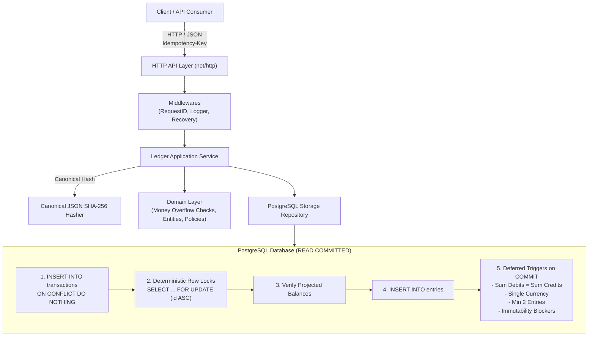

# Ledgerly

[](https://golang.org)
[](https://www.postgresql.org)
[](LICENSE)

**Ledgerly** is a high-integrity, production-grade **Buy Now, Pay Later (BNPL)** platform whose foundational core is an **immutable, append-only double-entry financial ledger** written in Go.

The platform splits purchases into installments, records every monetary movement as immutable balanced accounting entries, enforces concurrency-safe deterministic row locking, and provides atomic idempotency guarantees.

---

## 🏛️ System Architecture



---

## 💎 Financial & Engineering Principles

### 1. Money Representation & Safe Arithmetic
* All monetary amounts are represented as strict 64-bit signed integers (`int64`) in the minor unit of the currency (e.g., cents for USD: `$10.50` = `1050`).
* Floating-point numbers (`float32`, `float64`) are **strictly prohibited** across domain models, storage schemas, and API payloads.
* All monetary calculations implement **overflow-checked arithmetic** (`Add`, `Sub`, `Mul`) protecting against `math.MaxInt64` and `math.MinInt64` boundary exploits.

### 2. Double-Entry Zero-Sum Invariant
Every transaction consists of at least two `Entry` records satisfying:
$$\sum \text{Debits} - \sum \text{Credits} = 0$$
All entries within a single transaction must share the same ISO 4217 currency code.

### 3. Append-Only Immutability
* Records in `transactions` and `entries` can **never** be edited or deleted.
* PostgreSQL triggers (`BEFORE UPDATE OR DELETE`) raise SQLSTATE `55000` exceptions if modification or deletion is attempted.
* Corrections or disputes are executed exclusively through balancing **reversal transactions**.
* Single-reversal constraint: A transaction can only be reversed once (`UNIQUE(reversal_of)`).

### 4. Concurrency Control & Deadlock Elimination
* Transaction isolation level: **`READ COMMITTED` with deterministic row-level pessimistic locking (`SELECT ... FOR UPDATE`)**.
* Involved account IDs are sorted in strict lexicographical order (`account_id ASC`) prior to lock acquisition, eliminating cyclic dependencies and preventing deadlocks.
* Tested under high contention with parallel stress tests (50+ simultaneous goroutines).

### 5. Atomic Idempotency Pattern
* The idempotency key and canonical request hash (SHA-256) are persisted in the **same atomic database transaction** as the financial entries.
* Schema constraint: `UNIQUE (client_id, idempotency_key)`.
* Executed via `INSERT ... ON CONFLICT (client_id, idempotency_key) DO NOTHING`:
  - **New Request**: Row inserted, locks acquired, entries recorded, returns `201 Created`.
  - **Identical Retry**: Conflict occurs, original transaction loaded, hash matches, returns `200 OK` without duplicating entries.
  - **Payload Mismatch**: Same key with different payload/amounts returns `409 Conflict`.
  - **Concurrent Requests**: Interlocking unique index locks cause the second request to wait safely for the first to commit or rollback.

### 6. Defense-in-Depth Database Constraints
In addition to application domain validation, PostgreSQL enforces invariants at `COMMIT` time via deferred constraint triggers (`DEFERRABLE INITIALLY DEFERRED`):
- `trg_verify_entries_balance_and_currency`: Verifies $\sum \text{debits} = \sum \text{credits}$ and single currency.
- `trg_verify_transaction_min_entries`: Verifies `COUNT(entries) >= 2`.

---

## 📑 Architecture Decision Records (ADRs)

All foundational architectural decisions are documented in [`docs/adr/`](docs/adr/):

| ADR | Title | Status |
| :--- | :--- | :--- |
| [ADR-0001](docs/adr/0001-double-entry-invariants-and-money-representation.md) | Double-Entry Invariants, Money Representation, and Immutability | Accepted |
| [ADR-0002](docs/adr/0002-concurrency-control-and-isolation-strategy.md) | Concurrency Control, Isolation Strategy, and Race Validation | Accepted |
| [ADR-0003](docs/adr/0003-idempotency-pattern-and-concurrent-requests.md) | Idempotency Pattern, Atomic SQL Transactions, and Concurrent Retries | Accepted |

---

## 🚀 Getting Started

### Prerequisites
* [Docker](https://www.docker.com/) & Docker Compose
* [Go 1.22+](https://golang.org) (optional, if running locally without Docker)

### Running with Docker Compose
```bash
docker compose up -d --build
```
This spins up:
- PostgreSQL 16 on port `5432` with health checks.
- Ledgerly Ledger API on port `8080` (auto-applying database migrations on startup).

Check service health:
```bash
curl http://localhost:8080/healthz
curl http://localhost:8080/readyz
```

---

## 🧪 Testing Suite

The repository incorporates three layers of testing:

### 1. Domain Unit Tests & Rapid Property-Based Testing
Tests mathematical properties (commutativity, inverse elements, zero-sum preservation under arbitrary splits):
```bash
make test-unit
make test-property
```

### 2. PostgreSQL Integration Tests
Runs against real PostgreSQL instances (via `embedded-postgres` or local Docker PostgreSQL):
```bash
make test-integration
```
Verifies:
- Immutability trigger rejections (`UPDATE` / `DELETE`).
- Deferred constraint trigger rollbacks on unbalanced entries or empty transactions.
- Idempotency retries and conflict detection.
- Concurrent request serialization on the same idempotency key.
- 50-goroutine stress test ensuring zero deadlocks and global ledger balance preservation.

### 3. Run All Tests
```bash
make test
```

---

## 📡 API Reference & Examples

### 1. Create an Account
Supported types: `customer`, `merchant`, `platform`, `fees`.
```bash
curl -X POST http://localhost:8080/v1/accounts \
  -H "Content-Type: application/json" \
  -H "X-Client-ID: my_merchant_app" \
  -d '{
    "type": "customer",
    "currency": "USD"
  }'
```

### 2. Query Account Balance
Returns real-time aggregated debits and credits:
```bash
curl http://localhost:8080/v1/accounts/{account_id}/balance
```

### 3. Record a Balanced Transaction (with Idempotency)
```bash
curl -X POST http://localhost:8080/v1/transactions \
  -H "Content-Type: application/json" \
  -H "Idempotency-Key: purchase_order_tx_001" \
  -H "X-Client-ID: my_merchant_app" \
  -d '{
    "description": "BNPL Purchase - Order #1001",
    "entries": [
      {
        "account_id": "CUSTOMER_ACCOUNT_UUID",
        "amount": 10000,
        "direction": "DEBIT",
        "currency": "USD"
      },
      {
        "account_id": "MERCHANT_ACCOUNT_UUID",
        "amount": 9500,
        "direction": "CREDIT",
        "currency": "USD"
      },
      {
        "account_id": "FEES_ACCOUNT_UUID",
        "amount": 500,
        "direction": "CREDIT",
        "currency": "USD"
      }
    ]
  }'
```

### 4. Reverse a Transaction
```bash
curl -X POST http://localhost:8080/v1/transactions/{transaction_id}/reverse \
  -H "Content-Type: application/json" \
  -H "Idempotency-Key: refund_order_001" \
  -H "X-Client-ID: my_merchant_app" \
  -d '{
    "description": "Refund for Order #1001"
  }'
```

### 5. Query Account Ledger Entries (Statement)
```bash
curl "http://localhost:8080/v1/accounts/{account_id}/entries?limit=20&offset=0"
```
